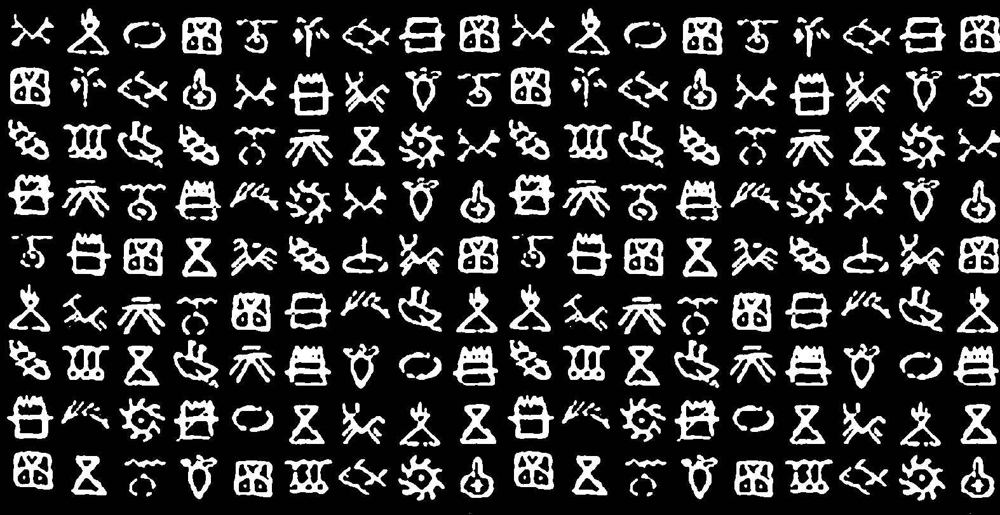
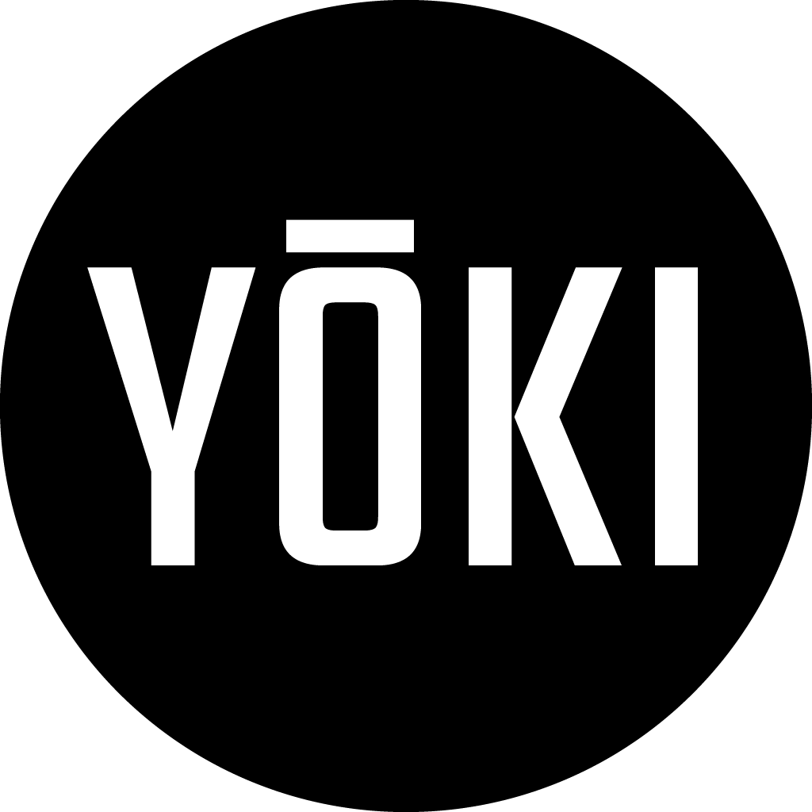
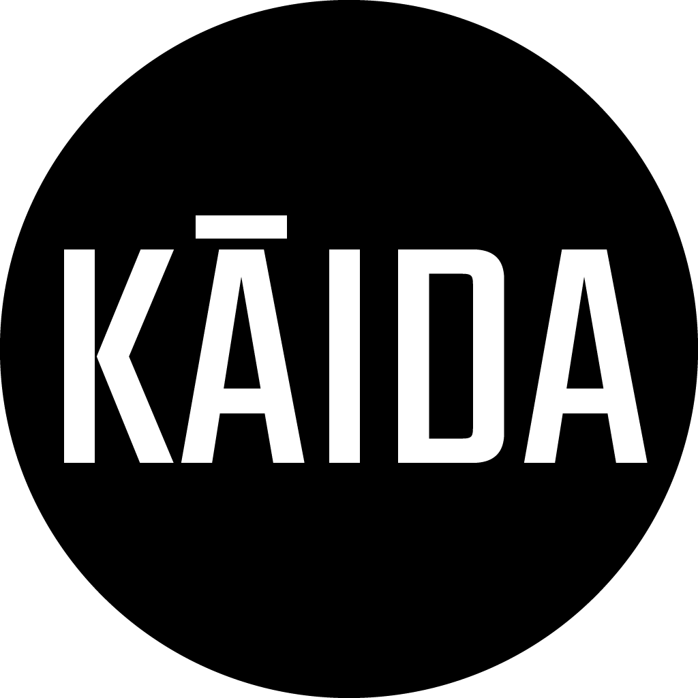
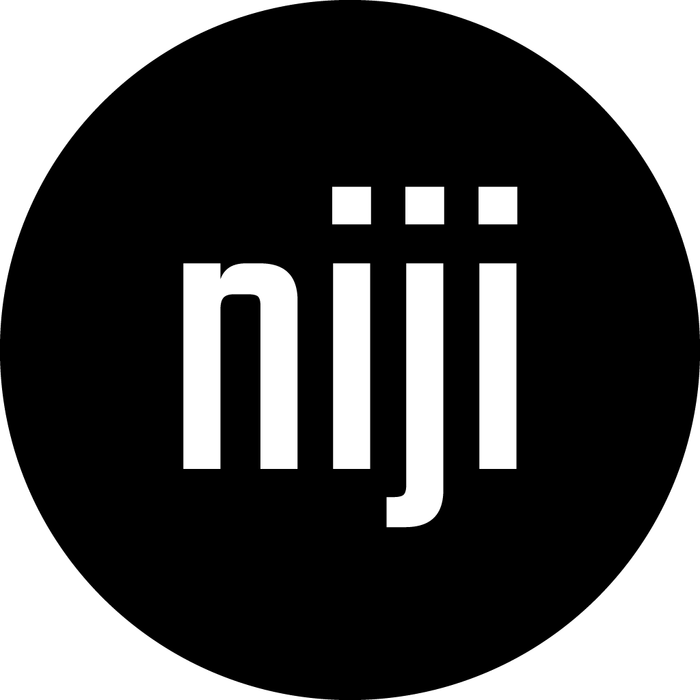
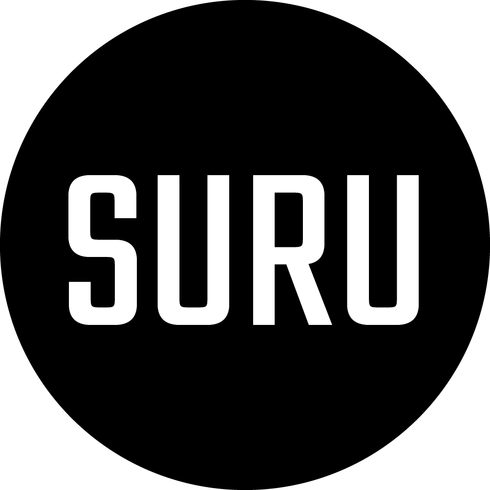
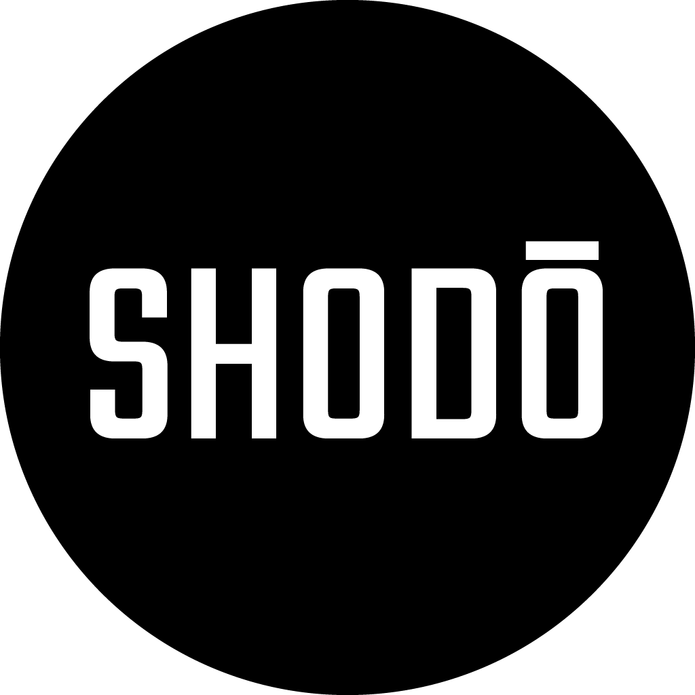

<div align="right">

[](https://github.com/scape-agency/icon.gl/blob/main/LICENSE)
[](https://vscode.dev/redirect?url=vscode://ms-vscode-remote.remote-containers/cloneInVolume?url=https://github.com/scape-agency/icon.gl)

</div>

---

<div>
    
    <h1 align="left">icon.gl</h1>
    <h3 align="left">Stylescape Icon Library</h3>
</div>

---


### Contents

- [Introduction](#introduction)
- [Colophon](#colophon)

<br clear="both"/>

---

<div align="right">

[](https://github.com/scape-agency/icon.gl/issues/new?assignees=&labels=Needs%3A+Triage+%3Amag%3A%2Ctype%3Abug-suspected&projects=&template=bug_report.yml)
[](https://github.com/scape-agency/icon.gl/issues/new?assignees=&labels=Needs%3A+Triage+%3Amag%3A%2Ctype%3Abug-suspected&projects=&template=feature_request.yml)
[](https://github.com/scape-agency/icon.gl/issues/new?assignees=&labels=Needs%3A+Triage+%3Amag%3A%2Ctype%3Abug-suspected&projects=&template=question.yml)
[](https://github.com/scape-agency/icon.gl/issues/new?assignees=&labels=Needs%3A+Triage+%3Amag%3A%2Ctype%3Abug-suspected&projects=&template=suggestion.yml)
[](https://github.com/scape-agency/icon.gl/issues/new?assignees=&labels=Needs%3A+Triage+%3Amag%3A%2Ctype%3Abug-suspected&projects=&template=discussion.yml)

</div>

**`icon.gl` is an inspired icon library based on the traditional Kaidā glyphs used historically in the Yaeyama Islands of Japan. These glyphs, rooted in local administration and communication, encompass a variety of symbols representing animals, plants, numerals, and household items.**

## Introduction

Icon.gl is a modern, innovative icon library infused with the essence of traditional [Kaidā glyphs](https://en.wikipedia.org/wiki/Kaid%C4%81_glyphs), echoing the historical charm of the Yaeyama Islands. Our design principles revolve around simplicity, modernity, and a touch of quirkiness. Each icon is distilled to its fundamental form, ensuring it embodies only the most essential characteristics. With bold geometric shapes, our icons boast a symmetrical and consistent look, providing unparalleled clarity and readability even at smaller sizes. This unique blend of contemporary design and cultural heritage makes icon.gl not just a collection of symbols, but a storytelling tool that bridges the past with the present.

<p align="center">
    
</p>

## Icons

|      |      |      |      |      |      |
| ---- | ---- | ---- | ---- | ---- | ---- |
| <small>pie_02</small> | <small>pie_03</small> | <small>star</small> | <small>swirl</small> | |

## Design principles

### Concept

`icon.gl` icons are designed to be simple, modern, friendly, and sometimes quirky. Each icon is reduced to its minimal form, expressing essential characteristics.

## Features

- Diverse Range
Includes icons representing a broad spectrum of elements from nature, agriculture, and domestic life.
- Integrates with Kyū (*q*) hybrid measurement unit used by the [`unit.gl`](https://unit.gl/) Layout Engine.
- Balanced

<!-- - Cultural Heritage: Reflects the rich historical context of the Yaeyama Islands.
- Numerical Symbols: Incorporates unique numeral systems, influenced by Suzhou numerals. -->

## Specifications

### Icon Sizes

The `icon.gl` library employs a unique approach to icon sizing, utilizing the Kyū (*q*) hybrid measurement unit. This unit is integral to the [`unit.gl`](https://unit.gl/) Layout Engine, ensuring a cohesive and scalable design across various platforms and devices. The standard size for `icon.gl` icons is set at 24 x 24 q, which is meticulously calibrated for optimal visibility and sharpness. Designers are encouraged to utilize icons at 100% scale to maintain pixel-perfect accuracy, critical for crisp and clear visuals.

#### Typographic Integration

#### Customization and Adaptability

While the provided sizes cover most use cases, `icon.gl` is designed with adaptability in mind. Designers can leverage the vector nature of the icons to create custom sizes or modifications, ensuring seamless integration with their specific design language or branding requirements.

In summary, `icon.gl` offers a versatile range of icon sizes, thoughtfully designed to balance clarity, visibility, and aesthetic appeal across various digital platforms. The use of Kyū (*q*) units in conjunction with standard pixel sizes ensures a harmonious integration with diverse design systems.

### Layout Areas

`icon.gl` icons are meticulously designed within a structured layout framework, ensuring consistency and precision across the entire library. This framework is defined using multiple measurement units including Kyū (*q*), millimeters (mm), relative units (rem), and pixels (px), catering to a wide range of design applications from digital to print.

|                   | Kyū (*q*)         | Print (*mm*)      | Display (*rem*)   | Template (*px*)   |
| :---------------- | ----------------: | ----------------: | ----------------: | ----------------: |
| **Canvas Area**   | 24 *q*            | 6 *mm*            | 1.50 *rem*        | 864 *px*          |
| **Live Area**     | 16 *q*            | 4 *mm*            | 1.00 *rem*        | 576 *px*          |
| **Bleed Area**    | 4 *q*             | 2 *mm*            | 0.25 *rem*        | 144 *px*          |

#### Detailed Layout Area Specifications

1. **Canvas Area (24 q | 6 mm | 1.50 rem | 864 px)**
   - The **Canvas Area** represents the total graphical boundary of an icon. It is the outermost layer, encompassing all aspects of the icon's design.
   - This area is crucial for maintaining a uniform size across all icons, ensuring they align perfectly in grid layouts and interface designs.
   - Icons must be contained within this area to prevent any part of the design from being inadvertently cropped or clipped in different usage contexts.

2. **Live Area (16 q | 4 mm | 1.00 rem | 576 px)**
   - The **Live Area** is the central zone where the primary elements of an icon are located. This is the focal point of the icon's design.
   - It is designed to ensure that the key components of the icon are always visible and are not obscured by interface elements like navigation bars, sidebars, or overlays.
   - The live area serves as a guide to maintain visual consistency and readability, especially in complex or dense UI environments.

3. **Bleed Area (4 q | 2 mm | 0.25 rem | 144 px)**
   - The **Bleed Area** acts as a buffer zone surrounding the Live Area. It provides additional space for the icon's design elements to extend if necessary, without encroaching on the Canvas Area.
   - This area is particularly useful when an icon requires extra visual emphasis or a more dynamic composition.
   - While the Bleed Area offers flexibility, it's important to use this space judiciously to maintain the icon's clarity and recognizability.

#### Enhanced Design Considerations

- **Padding and Margins:** Between each area, there is a carefully calculated padding and margin system. This system ensures that icons have ample breathing room, reducing visual clutter and enhancing legibility.
  
- **Scalability:** The defined areas also aid in scalability. By adhering to these guidelines, icons can be scaled up or down for different applications while retaining their intended visual impact and clarity.

- **Versatility in Application:** Whether for digital interfaces, print media, or mixed media applications, these layout areas provide a versatile foundation. They ensure that icons can be adapted to various contexts without losing their essence.

- **Consistency Across Devices:** The use of multiple units (q, mm, rem, px) ensures that icons maintain their intended appearance across devices and mediums, from high-resolution screens to printed materials.

#### Practical Application

- When designing with `icon.gl` icons, consider the context of use. For digital applications, focus on pixel and rem units; for print, refer to mm and q units.
- Use the Canvas Area as a guide for alignment in layouts, ensuring that icons uniformly line up in grids or lists.
- The Live Area is key for icon recognition; prioritize the most important elements of your design here.
- Utilize the Bleed Area for additional decorative elements or to create a more dynamic icon, but always ensure that these elements do not compromise the overall readability.

In summary, the `icon.gl` layout areas provide a robust framework for designing icons that are visually harmonious, easily scalable, and versatile across various applications and devices. These guidelines help designers create icons that are not only aesthetically pleasing but also functionally consistent and recognizably part of the `icon.gl` family.

#### Canvas Area

The **Canvas Area** is the complete size of a graphic. No parts of the icon should extend outside of the trim area.

##### Live Area

Icon content should remain inside of the **Live Area**, which is the region of an graphic that is unlikely to be hidden from view (such as when sidebars appear upon scrolling).

Icon content is limited to the 20dp x 20dp live area, with 2dp of padding around the perimeter.

##### Bleed Area

4q of padding, the **Bleed Area** surrounds the live area.

If additional visual weight is needed, content may extend into the padding between the live area and the **Bleed area** (the complete size of a graphic). No parts of the icon should extend outside of the trim area.

### Grid Layouts

The grid layout in `icon.gl` serves as the backbone for designing icons, providing a structured yet flexible framework. This system ensures that all graphic elements are aligned and proportioned consistently, resulting in a coherent set of icons.

#### Detailed Grid Specifications

1. **Grid Divisions and Measurements:**
   - The grid is divided into several key divisions: 8x, 12x, 16x, 24x, 32x, 36x, and 72x. Each division offers a different scale, allowing for precise placement and sizing of icon elements.
   - The divisions are mapped across different measurement units – Pixels (px), Kyū (*q*), Millimeters (mm), and Relative Units (rem) – to cater to various design needs, whether digital or print.

2. **Canvas Grid:**
   - The Canvas Grid is the largest, spanning 864 px in the template size. It breaks down into smaller divisions (108 px, 72 px, etc.) for detailed design work.
   - This grid is essential for establishing the overall boundary and scale of the icon, ensuring consistent sizing across the icon set.

3. **Live Area Grid:**
   - The Live Area Grid, smaller than the Canvas Grid at 576 px, is crucial for the main content of the icon. This area ensures that the most important parts of the icon are highlighted and easily recognizable.
   - The smaller divisions within this grid help designers align and size elements within the icon effectively, maintaining visual balance.

4. **Bleed Grid:**
   - The Bleed Grid, the smallest at 144 px, provides additional space around the Live Area. This is particularly useful for creating icons that require a bit more visual flair without compromising the core design.
   - This grid is especially useful for ensuring that extended elements or decorative features do not encroach on the Live Area.

#### Application in Icon Design

- **Grid Adaptability:** The grid system in `icon.gl` is designed to be adaptable, allowing designers to choose the appropriate grid size and line thickness based on the complexity and style of the icon.
  
- **Scalability and Consistency:** These grids ensure that icons are scalable across different platforms while maintaining consistency in visual style and proportions.

- **Flexibility in Design:** While the grids provide a structured framework, they are flexible enough to accommodate creativity and innovation in icon design.

In conclusion, the expanded grid layouts for `icon.gl` provide a comprehensive and versatile framework for designing icons. This system ensures that icons are not only visually appealing but also consistent and scalable across various applications. By adhering to these guidelines, designers can create icons that are both functional and aesthetically pleasing, enhancing the overall user experience.

|                   | Template          | 8 *x*     | 12 *x*    | 16 *x*    | 24 *x*    | 32 *x*    | 36 *x*    | 72 *x*    |
| :---------------- | ----------------: | --------: | --------: | --------: | --------: | --------: | --------: | --------: |
| **Canvas**        | 864 *px*          | 108 *px*  | 72 *px*   | 54 *px*   | 36 *px*   | 27 *px*   | 24 *px*   | 12 *px*   |
| **Live Area**     | 576 *px*          | 72 *px*   | 48 *px*   | 36 *px*   | 24 *px*   | 18 *px*   | 16 *px*   |  8 *px*   |
| **Bleed**         | 144 *px*          | 18 *px*   | 12 *px*   |  9 *px*   |  6 *px*   |  4.5 *px* |  4 *px*   |  2 *px*   |

### Lines

1. **Line Specifications:**
   - Five key line thicknesses are defined, ranging from 0.500 *q* to 2.000 *q*. These lines provide a guide for the stroke width in icon design.
   - The variation in line thicknesses allows for a range of visual weights, from delicate and refined to bold and impactful.

2. **Column Alignments:**
   - Each line thickness corresponds to a specific column width in the grid, ranging from 32x to 8x. This alignment ensures a harmonious balance between the icon's elements and the overall design.

### Enhanced and Expanded Line Guidelines in `icon.gl`

#### Comprehensive Overview of Line Specifications

The line specifications in `icon.gl` are meticulously defined, offering a range of thicknesses to cater to various design needs. These specifications are crucial for creating a visual hierarchy and imparting distinct character to each icon.

#### Detailed Line Thicknesses and Their Applications

1. **Line 1 (0.500 q | 0.1250 mm | 0.03125 rem | 18 px)**
   - **Use Case:** Ideal for subtle details and fine elements within an icon. This thickness is perfect for delicate features that require a touch of finesse without overpowering the main design.
   - **Grid Alignment:** Aligns with the 32x column, allowing for intricate detail work within a larger grid structure.

2. **Line 2 (0.667 q | 0.1667 mm | 0.06250 rem | 24 px)**
   - **Use Case:** Slightly thicker, this line is suitable for icons that need a bit more emphasis on certain elements without becoming too bold.
   - **Grid Alignment:** Fits within the 24x column, providing a balance between detail and prominence.

3. **Line 3 (1.000 q | 0.2500 mm | 0.06250 rem | 36 px)**
   - **Use Case:** The standard line thickness, offering a versatile choice for a wide range of icons. It strikes a balance between visibility and subtlety.
   - **Grid Alignment:** Corresponds to the 16x column, ideal for standard icon designs.

4. **Line 4 (1.333 q | 0.3333 mm | 0.08333 rem | 48 px)**
   - **Use Case:** Thicker lines for icons that demand more visual weight. Suitable for bold statements or icons that need to stand out.
   - **Grid Alignment:** Matches the 12x column, allowing for more substantial elements in the icon's design.

5. **Line 5 (2.000 q | 0.5000 mm | 0.25000 rem | 72 px)**
   - **Use Case:** The thickest option, ideal for icons that require maximum impact or need to convey strength and solidity.
   - **Grid Alignment:** Aligns with the 8x column, providing a robust framework for the most impactful designs.

#### Enhanced Design Flexibility and Consistency

- **Harmonious Integration:** These line thicknesses are designed to work in harmony with the `icon.gl` grid system, ensuring consistency across the icon library.
  
- **Scalability and Adaptability:** The varying line thicknesses cater to different scaling needs, ensuring icons maintain their integrity and clarity at various sizes.

- **Creative Versatility:** While offering a structured guide, these line specifications allow for creative flexibility, enabling designers to choose the best thickness that resonates with the icon's intended message and style.

#### Practical Application in Icon Design

- **Contextual Use:** Consider the context in which the icon will be used. Thinner lines might be more suitable for intricate, detailed icons, while thicker lines are better for icons that need to be more prominent and easily recognizable.
  
- **Balanced Composition:** Use the line specifications in conjunction with the keyline shapes and grid layouts to create a well-balanced and aesthetically pleasing icon.

- **Consistent Aesthetics:** Adhering to these specifications helps maintain a consistent look and feel across the icon set, enhancing the overall user experience.

In summary, the expanded line guidelines in `icon.gl` provide a comprehensive framework for designers to create icons with varied visual weights and styles. These guidelines ensure that icons are not only visually appealing but also coherent and functionally versatile, enhancing the overall design quality of the icon library.

|                   | Kyū (*q*)         | Print (*mm*)      | Display (*rem*)   | Template (*px*)   | Column (*x*)      |
| :---------------- | ----------------: | ----------------: | ----------------: | ----------------: | ----------------: |
| **Line 1**        | 0.500 *q*         | 0.1250 *mm*       | 0.03125 *rem*     | 18 *px*           | 32 *x*            |
| **Line 2**        | 0.667 *q*         | 0.1667 *mm*       | 0.06250 *rem*     | 24 *px*           | 24 *x*            |
| **Line 3**        | 1.000 *q*         | 0.2500 *mm*       | 0.06250 *rem*     | 36 *px*           | 16 *x*            |
| **Line 4**        | 1.333 *q*         | 0.3333 *mm*       | 0.08333 *rem*     | 48 *px*           | 12 *x*            |
| **Line 5**        | 2.000 *q*         | 0.5000 *mm*       | 0.25000 *rem*     | 72 *px*           |  8 *x*            |

### Keyline Shapes

### Enhanced and Expanded Keyline Shapes in `icon.gl`

#### Introduction to Keyline Shapes

Keyline shapes are pivotal in the `icon.gl` design system, serving as the fundamental building blocks for creating icons. These shapes ensure a consistent and harmonious visual language across the icon library, balancing uniformity with the flexibility required for creative expression.

#### Detailed Overview of Keyline Shapes

1. **Keyframe Circle:**
   - **Purpose:** The Keyframe Circle is ideal for icons that require a sense of continuity or encapsulation. It's perfect for symbols representing unity, completeness, or cyclical processes.
   - **Dimensions:** The circle's height and width are equal, emphasizing symmetry and balance. This shape is often used as a starting point for icons that need to convey a sense of harmony or focus.

2. **Keyframe Square:**
   - **Purpose:** The square shape is used for icons needing a sense of stability and balance. It's well-suited for symbols that represent strength, security, or structure.
   - **Dimensions:** Like the circle, the square has equal height and width, providing a stable and balanced foundation for icon design.

3. **Keyframe Portrait:**
   - **Purpose:** This shape is best for icons that require a vertical orientation, such as those representing growth, power, or upward movement.
   - **Dimensions:** The portrait shape is taller than it is wide, offering a visually appealing and dynamic structure for icons that need to emphasize verticality.

4. **Keyframe Landscape:**
   - **Purpose:** Ideal for icons that need a horizontal orientation, representing movement, flow, or progression.
   - **Dimensions:** Wider than it is tall, the landscape shape provides a broad canvas for icons requiring a more expansive feel.

#### Application and Versatility

- **Consistency in Visual Language:** By using these keyline shapes, designers can ensure that each icon conforms to a cohesive style, making the entire library look unified and professional.

- **Flexibility in Design:** While these shapes provide a guideline, they are not restrictive. Designers have the creative freedom to experiment within these frameworks, ensuring each icon is both unique and part of a larger, harmonious system.

- **Adaptability Across Themes:** These keyline shapes can be adapted to fit various themes and contexts, making them incredibly versatile. Whether designing for a tech-focused app or a nature-themed interface, these shapes provide a reliable starting point.

- **Enhanced User Experience:** Consistent keyline shapes contribute to a more intuitive and familiar user experience, as users learn to associate certain shapes with specific functions or meanings.

#### Conclusion

The expanded and enhanced keyline shapes in `icon.gl` offer a robust foundation for icon design. By adhering to these shapes, designers can create icons that are not only aesthetically pleasing and coherent but also flexible enough to adapt to various design needs and contexts. This approach ensures that the `icon.gl` library remains both diverse in its offerings and unified in its visual language.

<div align="center">
<table><tbody>

<tr><td valign="top">

Keyframe Circle
- height:
- width:

Keyframe Portrait
- height:
- width:

</td><td valign="top">


Keyframe Square
- height:
- width:

Keyframe Landscape
- height:
- width:

</td></tr>

</tbody></table>
</div>

### Icon Scaling

It is highly recommended to use the icons at their originally produced sizes. Scaling icons beyond their intended size can lead to a loss of detail or clarity. However, for specialized cases where custom sizes are needed, SVG format should be used to ensure that icons scale properly without quality degradation.

To cater to diverse design needs, `icon.gl` icons are meticulously crafted in four primary sizes:

1. **Small (16px):** Ideal for compact interfaces or where space is at a premium. These icons maintain their distinctiveness even at reduced scales, making them perfect for mobile applications or intricate web elements.

2. **Medium (20px):** A slightly larger variant, offering a balance between visibility and space efficiency. This size is versatile, suitable for a variety of digital mediums including web interfaces, mobile apps, and interactive displays.

3. **Standard (24px):** This is the default size, optimized for the majority of use cases. It strikes an ideal balance between prominence and subtlety, ensuring readability without overwhelming the user interface.

4. **Large (32px):** Designed for situations where icons need to be more prominent. This size is particularly effective in desktop applications, interactive kiosks, or any interface where icons serve as primary navigation or interaction elements.

## File Formats and Accessibility

Each icon size is provided in both SVG and Adobe Illustrator file formats. SVGs offer scalability and flexibility, perfect for responsive web design and applications where file size and load times are critical. Adobe Illustrator files provide a vector-based format for high-fidelity editing, allowing designers to customize icons to fit their specific project needs.

- **SVGs:** These are ideal for web use, ensuring that icons scale perfectly across different screen resolutions and sizes. SVGs also support modifications and animations, making them highly adaptable.

- **Responsive Design:** Icons are crafted to be responsive, ensuring they maintain their integrity and legibility across different devices and screen sizes.

## Best Practices

### Color

Icons are always a solid, monochromatic color and need to pass the same color contrast ratio as typography (4.5:1). The color of the icon should reflect the importance of the icon’s action which should always be to help guide a user. For more information on color, see Color in UI.

#### Dense layouts

On desktop, when the mouse and keyboard are the primary input methods, measurements may be scaled down to 20dp.

## Usage

Ideal for projects seeking a blend of historical and cultural aesthetics with functional iconography.

Iconography is highly functional in a user interface. When used wisely, icons become an elegant yet efficient way to communicate with and help guide a user through an experience. To maintain this functionality, it’s important to reduce cognitive load on users by employing icons sparingly and strategically throughout your designs.

## Installation

Instructions on how to integrate icon.gl into your project.

``` sh
npm i icon.gl
```

## Template

Create your own system and product icons with these Adobe Illustrator files including the 24dp icon grid.

### Template Setttings

#### Units

- General: Pixels
- Stroke: Pixels
- Type: Pixels

#### Guides

- Color: Light Blue
- Style: Lines

#### Grid

- Color: Light Gray
- Style: Lines
- Gridlines every: 64 px
- Subdividsions

#### View

- Snap to Grid

#### Artboards

- 64 artboards (8x8)
- Artboards are snapped to the document grid.
-

Layout
Violet

Keyframes
Medium Blue Template

#### Grids

Grid 128px  grid-128px   grey    4px     10%     Light Gray     Template
Grid 64px   grid-64px   grey    3px     10%       Light Gray    Template
Grid 32px   grid-32px   grey    2px     10%        Light Gray   Template
Grid 16px   grid-16px   grey    1px     10%        Light Gray   Template

Areas
Peach Template

### Stylescape

<p align="center">
    <a href="https://github.com/scape-agency/kyu">
        
    </a>
    <a href="https://github.com/scape-agency/yoki">
        
    </a>
    <a href="https://github.com/scape-agency/kaida">
        
    </a>
    <a href="https://github.com/scape-agency/niji">
        
    </a>
    <a href="https://github.com/scape-agency/suru">
        
    </a>
    <a href="https://github.com/scape-agency/shodo">
        
    </a>
</p>

- <https://www.npmjs.com/package/stylescape>

## Links

### Guidelines

- [Material Design - System Icons](https://m2.material.io/design/iconography/system-icons.html)
- [IBM Design Language | Iconography | UI Icons](https://www.ibm.com/design/language/iconography/ui-icons/usage/)
- [Choosing the right size and format for icons](https://blog.icons8.com/articles/choosing-the-right-size-and-format-for-icons/)
- [Apple developer - App icons](https://developer.apple.com/design/human-interface-guidelines/app-icons)
- [Microsoft Windows - Icons (Design basics)](https://learn.microsoft.com/en-us/windows/win32/uxguide/vis-icons)
- [Pluralsight | Design System | Iconography](https://design-system.pluralsight.com/core/iconography)

#### Other Sets

- [Fort Awesome | GitHub](https://github.com/FortAwesome/Font-Awesome)
- <https://labs.mapbox.com/maki-icons/>
- <https://github.com/joypixels/emoji-toolkit>
- <https://github.com/primer/octicons>
- <https://github.com/fontello/fontello>
- <https://github.com/ionic-team/ionicons>
- <https://github.com/somerandomdude/Iconic>

## Ref

- [Making SVG icon libraries for React apps](https://nicolasgallagher.com/making-svg-icon-libraries-for-react-apps/)
- <https://github.com/mryechkin/acme-icons>
- <https://github.com/necolas/icon-builder-example>
- [Using npm to create JavaScript icon libraries](https://blog.logrocket.com/using-npm-to-create-javascript-icon-libraries/)
- <https://github.com/kreuzerk/svg-icon-library-starter>

---

## Colophon

### Development Resources

#### Version

This documentation is in version `v0.0.1`.
Last edited: `07/2024`

<!-- #### Versions

The repository provides a track of different versions of the assets for easier navigation and understanding of the evolution of the brand. Each version is tagged with a unique identifier.

1.0.0 Initial release of brand assets
1.0.1 Minor tweaks to the color palette
1.1.0 Introduction of new logo variants
1.1.1 Fixes to SVG assets
1.2.0 Update of Typography guidelines
1.2.1 Minor fixes to the logo files
1.3.0 Addition of new graphics and diagrams
1.3.1 Updated Readme
1.4.0 Introduction of new Templates
1.4.1 Updated copyrights and licensing information -->

<!-- #### Branches

- `Master` Stable, production-ready version of the brand assets
- `Develop` Work in progress, latest changes and updates -->

#### Authors

**icon.gl** is an open-source project by **[Scape Agency](https://www.scape.agency "Scape Agency website")**.

##### Scape Agency

Scape Agency is a spatial innovation collective that dreams, discovers and designs the everyday of tomorrow. We blend design thinking with emerging technologies to create a brighter perspective for people and planet. Our products and services naturalise technology in liveable and sustainable –scapes that spark the imagination and inspire future generations.

- website: [scape.agency](https://www.scape.agency "Scape Agency website")
- github: [github.com/scape-agency](https://github.com/scape-agency "Scape Agency GitHub")

<!-- #### Contributors

We are proud to acknowledge the contributions made by individuals from around the world. The success of this repository is a result of the collaborative efforts of these passionate individuals. -->

<!-- Contributions
Contributions to this project follow the all-contributors specification. Each contributor gets recognition for their work in the contributors section. -->
<!-- Pull Requests
Pull requests are always welcome. If you wish to contribute or make changes, please make a pull request. If it's a substantial change, please create an issue first, to discuss it. -->

<!-- Community
Join our community and contribute towards the development and enhancement of the brand assets. We value all our contributors and aim to create a vibrant community that supports and helps each other. -->

#### Contributing

We'd love for you to contribute and to make this project even better than it is today!
Please refer to the [contribution guidelines](.github/CONTRIBUTING.md) for information.

<!-- 
#### Sponsorships

Your sponsorships help us maintain this project. You can sponsor this project through the sponsorship link provided. Your contribution can help us in many ways, from keeping our servers up and running, to supporting the further development and improvement of these assets.

Issues
In case you find any errors or have suggestions for improvements, we encourage you to raise an issue. The Issues tab is a space for community members to discuss problems they’ve encountered, suggest enhancements, and more.

#### FAQ
We have compiled a list of frequently asked questions for easier navigation and understanding of this repository. If you have more questions, please raise an issue and we will be glad to assist you. -->

### Legal Information

#### Copyright

Copyright &copy; 2024 [Scape Agency BV](https://www.scape.agency/ "Scape Agency website"). All Rights Reserved.

#### License

Except as otherwise noted, the content in this repository is licensed under the
[Creative Commons Attribution 4.0 International (CC BY 4.0) License](https://creativecommons.org/licenses/by/4.0/), and
code samples are licensed under the [Apache 2.0 License](http://www.apache.org/licenses/LICENSE-2.0).

Also see [LICENSE](https://github.com/block-foundation/community/blob/master/src/LICENSE) and [LICENSE-CODE](https://github.com/block-foundation/community/blob/master/src/LICENSE-CODE).

#### Disclaimer

**THIS SOFTWARE IS PROVIDED AS IS WITHOUT WARRANTY OF ANY KIND, EITHER EXPRESS OR IMPLIED, INCLUDING ANY IMPLIED WARRANTIES OF FITNESS FOR A PARTICULAR PURPOSE, MERCHANTABILITY, OR NON-INFRINGEMENT.**
